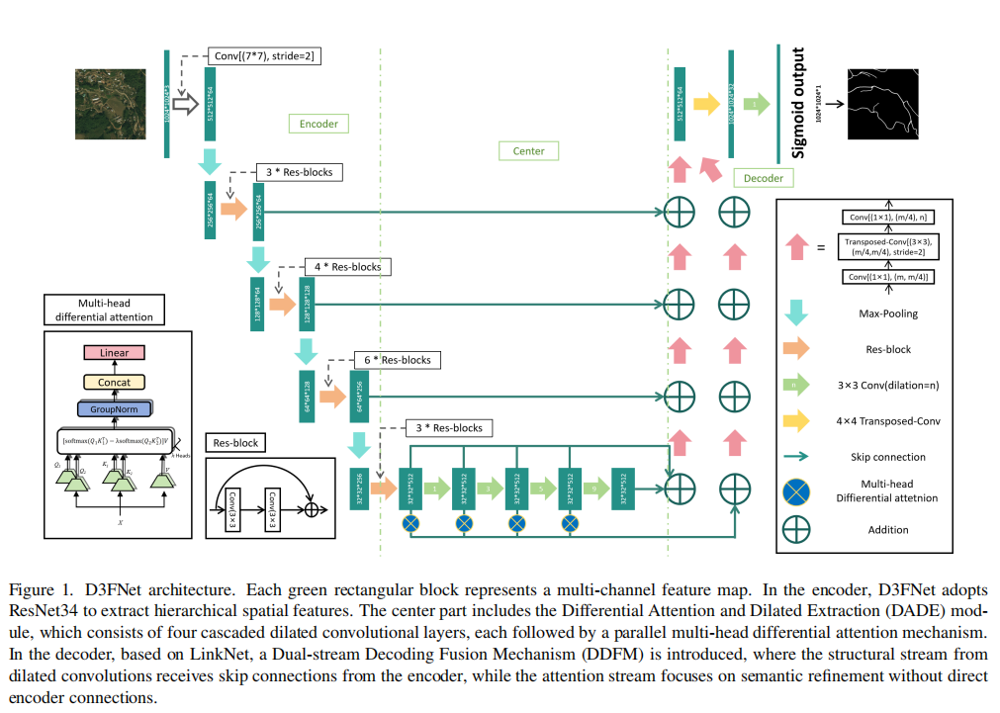

# D3FNet: Differential Attention Fusion Network for Fine-Grained Road Extraction

Official implementation of our ICCV 2025 paper:  （ DriveX paper id 5 ）

**"D3FNet: A Dilated Dual-Stream Differential Attention Fusion Network for Fine-Grained Road Structure Extraction in Remote Perception Systems"**  

📄 [Read the Paper on arXiv](https://arxiv.org/abs/2508.15537)

<p align="center">
  
</p>

## 🖋 Authors

**Chang Liu** (Corresponding author: [changliu@hit.bme.hu](mailto:changliu@hit.bme.hu), [changliu@sztaki.hu](mailto:changliu@sztaki.hu))  
**Yang Xu** ([xuy@edu.bme.hu](mailto:xuy@edu.bme.hu))  
**Tamas Sziranyi** ([sziranyi.tamas@sztaki.hun-ren.hu](mailto:sziranyi.tamas@sztaki.hun-ren.hu))  

**Affiliations:**  
1. Department of Networked Systems and Services, Faculty of Electrical Engineering and Informatics, Budapest University of Technology and Economics (BME), Budapest, Hungary  
2. Machine Perception Research Laboratory, HUN-REN Institute for Computer Science and Control (SZTAKI), Budapest, Hungary


## 🔍 Abstract

Extracting narrow roads from high-resolution remote sensing imagery remains a significant challenge due to their limited width, fragmented topology, and frequent occlusions. To address these issues, we propose **D3FNet**, a *Dilated Dual-Stream Differential Attention Fusion Network* designed for fine-grained road structure segmentation in remote perception systems. Built upon the encoder–decoder backbone of D-LinkNet, D3FNet introduces three key innovations:

1. **Differential Attention Dilation Extraction (DADE)** module to enhance subtle road features while suppressing background noise;
2. **Dual-stream Decoding Fusion Mechanism (DDFM)** that integrates original and attention-modulated features for better spatial precision and semantic context;
3. **Multi-scale dilation strategy (rates 1, 3, 5, 9)** to reduce gridding artifacts and improve continuity in narrow road prediction.

Extensive experiments on **DeepGlobe** and **CHN6-CUG** benchmarks show that D3FNet achieves superior IoU and recall on challenging road regions, outperforming state-of-the-art baselines.  

---

## ✨ Key Contributions

- 🔹 We introduce **D3FNet**, combining differential attention and dual-stream decoding into the D-LinkNet framework.  
- 🔹 A novel **DADE module** improves feature discrimination and suppresses cluttered backgrounds.  
- 🔹 A **DDFM structure** preserves continuity in occluded/narrow roads.  
- 🔹 State-of-the-art performance on **DeepGlobe** and **CHN6-CUG**, validating robustness in cooperative driving scenarios.  

---

## 📞 Contact

If you have any questions about reproducing this work, please contact Xu Yang:
- [xuy@edu.bme.hu](mailto:xuy@edu.bme.hu)
- [xuy0727@gmail.com](mailto:xuy0727@gmail.com)

## 📌 Useful Information (Baseline: D-LinkNet34)

D3FNet is built upon the winning solution of the **DeepGlobe Road Extraction Challenge (1st Place)**.  
[DeepGlobe Road Extraction Challenge](https://competitions.codalab.org/competitions/18467)

For reproducibility and fair comparison, we summarize the baseline usage here:

### Requirements (Baseline)
- CUDA 8.0
- Python 2.7
- PyTorch 0.2.0
- OpenCV (cv2)

### Train
- Run `python train_lr.py` to train the default D-LinkNet34.
Remember to choose the right model from Diffdlinknet_v6.py, which is Dlinknet34.
The input image must be a three-channel RGB image and have a square shape.

### Predict
- Run `Validation.py` to predict on the default D-LinkNet34.
Remember to choose the right model from Diffdlinknet_v6.py, which is Dlinknet34.
Then should change source dataset and load the weight that have been trained.

### Download trained D-LinkNet34
- [Dropbox](https://www.dropbox.com/sh/h62vr320eiy57tt/AAB5Tm43-efmtYzW_GFyUCfma?dl=0)
- [百度网盘](https://pan.baidu.com/s/1wqyOEkw5o0bzbuj7gBMesQ)

  
## 📑 Citation

If you find this work useful, please cite our paper:

```bibtex
@misc{liu2025d3fnetdifferentialattentionfusion,
      title={D3FNet: A Differential Attention Fusion Network for Fine-Grained Road Structure Extraction in Remote Perception Systems}, 
      author={Chang Liu and Yang Xu and Tamas Sziranyi},
      year={2025},
      eprint={2508.15537},
      archivePrefix={arXiv},
      primaryClass={cs.CV},
      url={https://arxiv.org/abs/2508.15537}, 
}
